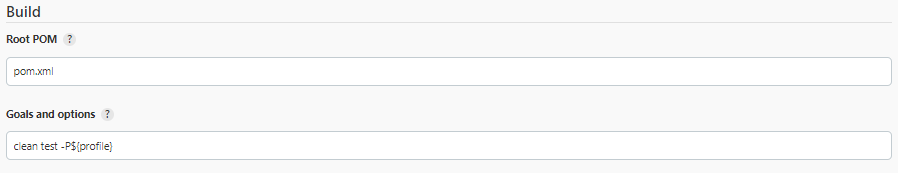

# Crewmeister Assignment
----------

## Abstract Idea about the application:

----------

1.User can amend or add a crew,add employees and add team

2.User can assign an employee to a team or a team to an employee

3.User can assign the role as manager,accountant from the individual settings

4.Changes made in the settings will be visible in the Time Tracking page in the table,from where user can enable team or member

5.User can clock the working time by clicking on the start button,can clock breaks,add notes and select category

6.User can adjust and do manual correction in stamps

## Keynotes:

-----------
1.Test cases added would validate following business scenarios:

    >To validate whether user is able to see owner of the crew in Time Tracking Page.
    >To validate whether user is able to assign employee to a team and is displayed in Time Tracking Page.

2.Current application is a good candidate for API automation as it deals with compled time logs,interacting via the UI would
result in flaky tests.

3.Delete API call would help in removing the records from DB and thus avoid the pain of creating unique data for each
test.

## Libraries Used:
----------
**1.Selenium         -** Web Automation

**2.TestNG           -** Unit Testing Library

**3.Extent Reports   -** Reporting Library to generate beautiful html reports

**4.AssertJ          -** Fluent Assertion Library in Java

**5.WebDriverManager -** Executables management

**6.Lombok           -** To reduce boilerplate codes

**7.Faker            -** To generate random test data

Note:All the above mentioned libraries are open-source and does not include any license.

#Capabilities:
------------
1.Web Tests can be run on chrome or edge browsers.

2.Configuration can be changed from config.properties inside src/test/resources/config

3.Utility methods available for Web Interactions (SeleniumUtils.java)

4.Integration with Jenkins for scheduling is easy

#Adding more tests:
-----------
Prerequisites: Java 8+ , Maven 3.6.3 Installed and path set

1.Tests should be added as per the convention followed. New testng tests should be created inside the src/test/java folder.

2.All the tests should extend BaseTest.java

3.Each test created should define the description as mandatory parameters. This will be helpful while creating the extent reports.

4.Have maximum of one to two assertions per test.

#Running Tests:
----------
Prerequisites: Java 8+ , Maven 3.6.3 Installed and path set

1.There are multiple ways to run the tests. During development phase you can use the testng.xml present in the root folder to run. Right click and choose run.

2.Each of the testng xml file should contain the test classes to pick for the run.

3.User can also choose the thread-count parameter to run the tests in parallel.

4.User can also choose to run via maven commands which is highly recommended.

5.Maven profiles are configured in the pom.xml. You can run these from IDE Terminal or any OS Terminal inside the project folder.
**mvn clean test -Pall** - To run all the tests available in the testng.xml

**Note:** User should not try to run the test from test class - Might end up in Null Poinet Exceptions,because the listeners are configured only in testng.xml

#Report Interpretation
------------
1.Dashboard view clearly indicates the start time, end time of the run, number of tests passed and failed. It also shows the time took for the individual tests in form of timeline. Hover the mouse over the timeline to get the exact time details.

2.Tags tab in the Dashboard view clearly indicates the pass and fail according to the functionality.

3.Click on each test tab to view the corresponding test log events.

4.All the web tests will have a screenshot attached on failure as well as pass

5.After each test run, reports can be found under root directory and ExtentReports folder.

#Jenkins Integration

-----------
1.This project can be easily integrated with Jenkins

2.Login to Jenkins

3.Create Maven Project(Add maven plugin if not present)

4.Configure choice parameters to run different maven profiles

5.Configure goal and options

6.Choose custom workspace and give the project location

7.To run,select Build with parameters -> Choose profile -> Click Build

8.View the results in the console output

